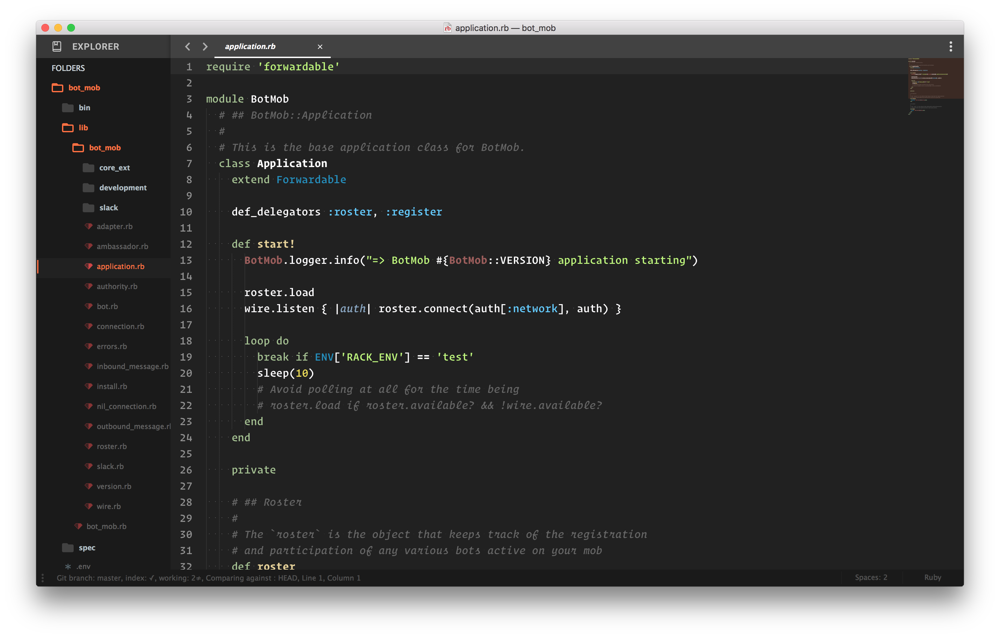
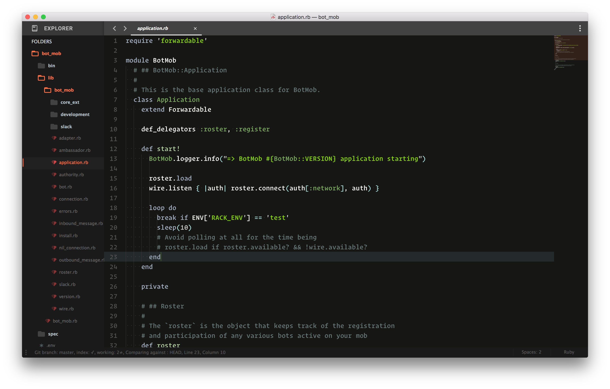

# Sublime Resources

## Preferences

The Preferences file sets up small behavior tweaks, use of the Material Theme, general look and feel, and omits folders from the sidebar:

[`preferences.json`](https://github.com/mwerner/sublime/blob/master/preferences.json)

## Themes

#### Chalked

Chalked is the theme I use most. Focused on high contrast colors while staying in a natural spectrum.

#### Hack

I started these theme recently. It still needs some work, but I'm hoping to get something that's good for late night work.

