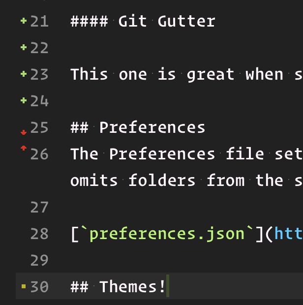
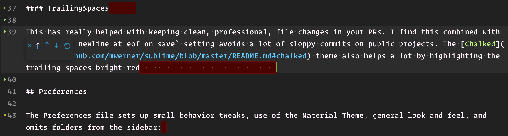

# Sublime Resources

## Package Control

Package Control is a required addition to make use of community plugins

```
import urllib.request,os; pf = 'Package Control.sublime-package'; ipp = sublime.installed_packages_path(); urllib.request.install_opener( urllib.request.build_opener( urllib.request.ProxyHandler()) ); open(os.path.join(ipp, pf), 'wb').write(urllib.request.urlopen( 'http://sublime.wbond.net/' + pf.replace(' ','%20')).read())
```

Generally when it comes to plugins, I try to add only the very essentials. Get too many extensions and I always feel like it bogs down a snappy editor. To that end, this is the list of packages I use:

#### [ChangeQuotes](https://github.com/colinta/SublimeChangeQuotes)

Crucial for converting a single quote string to a double when an interpolation need is added.

#### [Git](https://github.com/kemayo/sublime-text-git)

Really necessary to be able to issue small git commands. I mainly end up using it for `git blame`

#### [Git Gutter](https://github.com/jisaacks/GitGutter)

This one is great when skimming a file to find your changes. Nicely displays the changes alongside the gutter.



#### [HTML-CSS-JS Prettify](https://github.com/victorporof/Sublime-HTMLPrettify)

Consistency in your style is great, this guy helps enforce.

#### [JSON Reindent](https://github.com/ThomasKliszowski/json_reindent)

See above

#### [Material Theme](https://github.com/equinusocio/material-theme)

I've grown to really like the blended sidebar, color scheme, and clean lines. Combine that with the high contrast [Chalked](https://github.com/mwerner/sublime/blob/master/README.md#chalked) theme and you've got an editor you can look at for long periods of time without any problems.

#### [TrailingSpaces](https://github.com/SublimeText/TrailingSpaces)

This has really helped with keeping clean, professional, file changes in your PRs. I find this combined with the `ensure_newline_at_eof_on_save` setting avoids a lot of sloppy commits on public projects. The [Chalked](https://github.com/mwerner/sublime/blob/master/README.md#chalked) theme also helps a lot by highlighting the trailing spaces bright red



#### Syntax Highlighting

Including: [CSV](https://github.com/ericmartel/Sublime-Text-2-CSV-Plugin), [Dockerfile](https://github.com/asbjornenge/Docker.tmbundle), [Haml](https://github.com/pachkovsky/sublime-html-to-haml), [Sass](https://github.com/nathos/sass-textmate-bundle), [JSX](https://github.com/allanhortle/JSX)

## Preferences

The Preferences file sets up small behavior tweaks, use of the Material Theme, general look and feel, and omits folders from the sidebar:

[`preferences.json`](https://github.com/mwerner/sublime/blob/master/preferences.json)

## Themes

#### Chalked

Chalked is the theme I use most. Focused on high contrast colors while staying in a natural spectrum.


#### Hack

I started these theme recently. It still needs some work, but I'm hoping to get something that's good for late night work.


